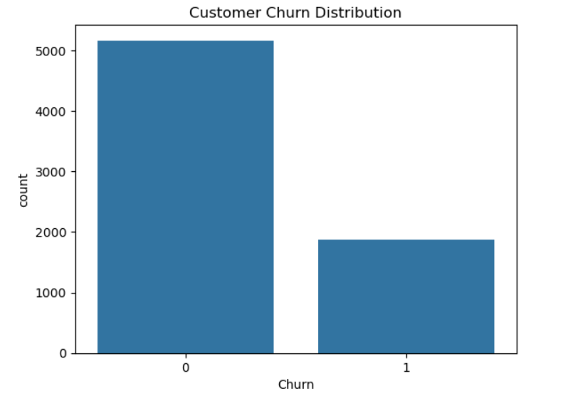
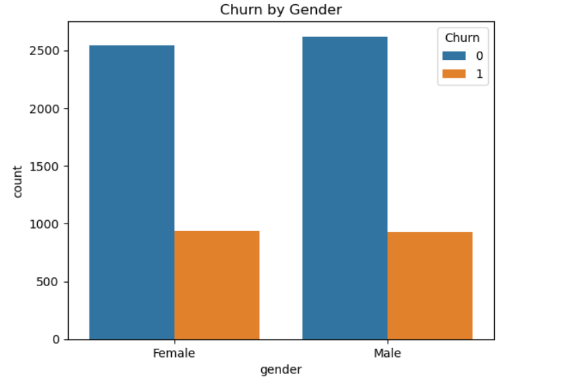
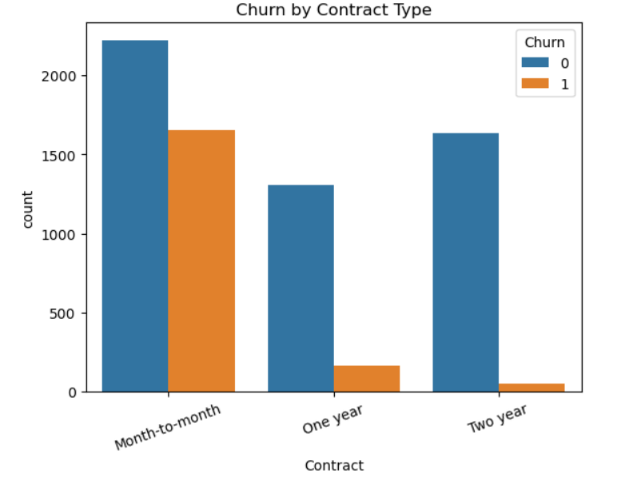
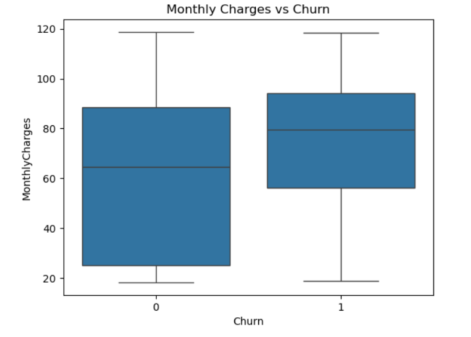
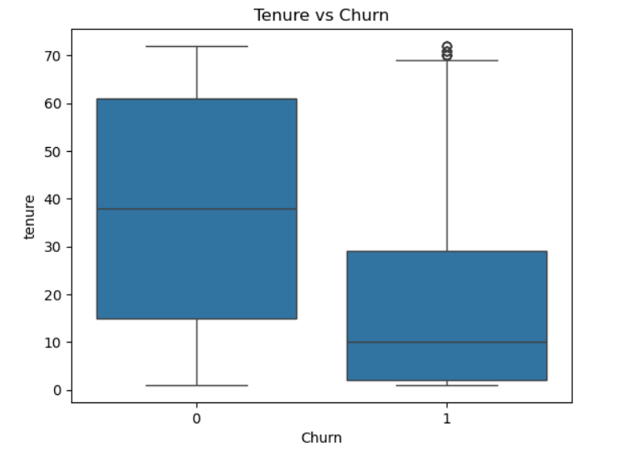
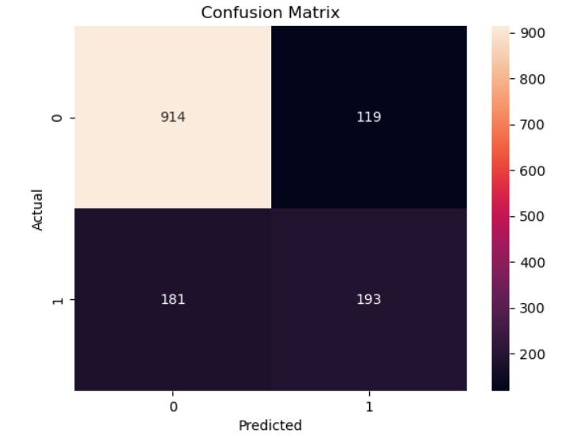

# Customer Churn Prediction

## Overview
This project predicts customer churn in a telecom company using machine learning.

Customer churn occurs when customers stop using a company's services. Predicting churn helps companies identify customers who are likely to leave.

## Dataset
Telco Customer Churn dataset containing more than 7000 customer records.

## Technologies Used
Python  
Pandas  
NumPy  
Matplotlib  
Seaborn  
Scikit-learn  
Jupyter Notebook  

## Machine Learning Model
Logistic Regression

## Model Accuracy
~78%

## Workflow
1. Data Loading
2. Data Cleaning
3. Exploratory Data Analysis
4. Feature Encoding
5. Model Training

6. Model Evaluation

## Exploratory Data Analysis

### Customer Churn Distribution

### Churn by Gender

### Churn by Contract Type

### Monthly Charges vs Churn

### Tenure vs Churn

## Model Evaluation

### Confusion Matrix

